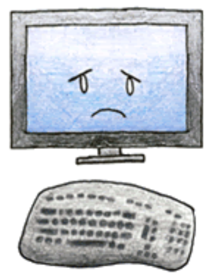
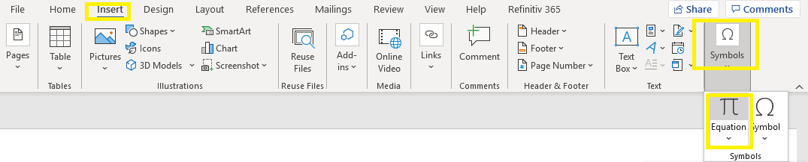
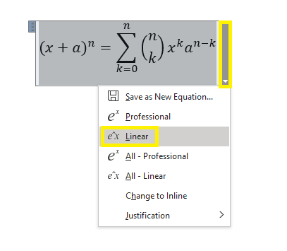
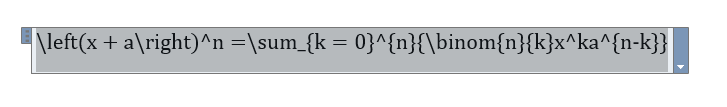
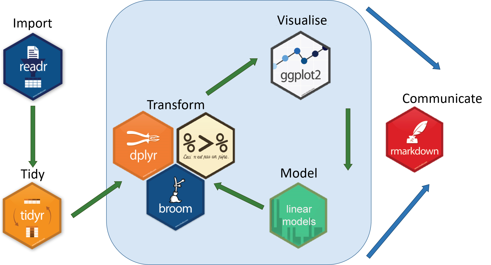

```{r setup, include=FALSE}
knitr::opts_chunk$set(echo = TRUE, message = FALSE, warning = FALSE)
library(tidyverse)
```

# Objectives

- Create "Toy Data"

  - `data.frame()`
  
  - `tibble()`
  
  - `tribble()`

- Reproducible example

- Export

- RMD:

  - tables: regression; statistics
  
  - equations


# "Toy Data"


- `data.frame` ?

- `tibble`?
  

## data.frame

```{r}
class(iris) 
```

```{r, eval = FALSE}
iris
```

```
    Sepal.Length Sepal.Width Petal.Length
1            5.1         3.5          1.4
2            4.9         3.0          1.4
3            4.7         3.2          1.3
4            4.6         3.1          1.5
5            5.0         3.6          1.4
...

```


## tibble


```{r, eval = FALSE}
iris %>% as_tibble()
```


---

```
# A tibble: 150 x 5
   Sepal.Length Sepal.Width Petal.Length Petal.Width Species
          <dbl>       <dbl>        <dbl>       <dbl> <fct>  
 1          5.1         3.5          1.4         0.2 setosa 
 2          4.9         3            1.4         0.2 setosa 
 3          4.7         3.2          1.3         0.2 setosa 
 4          4.6         3.1          1.5         0.2 setosa 
 5          5           3.6          1.4         0.2 setosa 
 6          5.4         3.9          1.7         0.4 setosa 
 7          4.6         3.4          1.4         0.3 setosa 
 8          5           3.4          1.5         0.2 setosa 
 9          4.4         2.9          1.4         0.2 setosa 
10          4.9         3.1          1.5         0.1 setosa 
# ... with 140 more rows
```


---

More details:

[\textcolor{blue}{https://r4ds.had.co.nz/tibbles.html}](https://r4ds.had.co.nz/tibbles.html)

## Create

### data.frame()
```{r}
df1 <- data.frame(
  guitarist = c("Joe Satriani", "Eric Johnson"),
  year = c(1987, 1990),
  song = c("Always With Me, Always With You",
           "Cliffs of Dover")
)
```

---
```{r}
class(df1)
df1
```

### tibble()

```{r}
df2 <- tibble(
  guitarist = c("Joe Satriani", "Eric Johnson"),
  year = c(1987, 1990),
  song = c("Always With Me, Always With You",
           "Cliffs of Dover")
)
```

---
```{r}
class(df2)
df2
```


### tribble()


```{r}
df3 <- tribble(
  ~ guitarist,         ~ year, ~ song,
  "Joe Satriani", 1987, "Always With Me, Always With You",
  "Eric Johnson", 1990, "Cliffs of Dover"
)
```

---
```{r}
class(df3)
df3
```

# Reproducible Example

```{r, echo = FALSE, out.width = "150px", fig.align='center'}

```

---

```{r, echo = FALSE, out.width = "350px", fig.align='center'}
knitr::include_graphics("images/rstudio-community.png")
```

---

1. Select your code

```{r, echo = FALSE, out.width = "400px"}
knitr::include_graphics("images/rep1.png")
```

---

2. Click `Addins` then `Reprex selection`

```{r, echo = FALSE,out.width = "400px"}
knitr::include_graphics("images/rep2.png")
```

---

[\textcolor{blue}{https://community.rstudio.com/t/test-post-brm-lab-2021-please-do-not-reply/104182}](https://community.rstudio.com/t/test-post-brm-lab-2021-please-do-not-reply/104182)

---

```{r, echo = FALSE, out.width = "300px", fig.align='center'}
knitr::include_graphics("images/rstudio-community2.png")
```


---

```{r, echo = FALSE, out.width = "300px", fig.align='center'}
knitr::include_graphics("images/rstudio-community3.png")
```

# Export("write")

Boss: Give me

   - an Excel file.
   
   - a CSV file.
   
Colleague (who speaks R):

  - Give me your data.
  
---

```{r}
df <- gapminder::gapminder %>%
  filter(year >= 2000) %>% 
  group_by(year, continent) %>% 
  summarise(mean_life_exp = mean(lifeExp)) %>% 
  pivot_wider(
    names_from = year,
    values_from = mean_life_exp
  )
  
```

---

```{r}
df
```

---

```{r csv}
# CSV using readr package
readr::write_csv(df, "data/boss.csv")
```

```{r writexl}
# Excel using the writexl package
writexl::write_xlsx(df, "data/boss.xlsx")
```

```{r rds}
# RDS
saveRDS(df, "data/colleague.RDS")
```

## Import("read")

```{r}
readr::read_csv("data/boss.csv")
```

---

```{r}
readxl::read_excel("data/boss.xlsx")
```
---

```{r}
readRDS("data/colleague.RDS") 
```

# Survey

```{r, echo = FALSE, out.width = "300px", fig.align='center'}
knitr::include_graphics("images/ucp-survey.png")
```

- S1: between 17:00 and 18:30.

- S2: between 15:30 and 17:00.

# Tables

## Regression 


`install.packages("stargazer")`


We will use [\textcolor{blue}{25.8 An Example}](https://af-ucp.courses/brm/ldv.html#anexample001)


Get the `Tables-Equations.Rmd` from 
[\textcolor{blue}{here}](https://ucppt-my.sharepoint.com/:f:/g/personal/bhaswar_chakma_ucp_pt/EqzoMzkKUu5Nokp5QyB_cDcB7iHRj168PMthDf3HJkfAYA?e=azL36r)


---


```{r, include = FALSE}
# ols
m0 <- lm(low ~ smoke + race + ht + ui + ftv + age + lwt,
         data = MASS::birthwt)
# logit
m1 <- glm(low ~ smoke + race + ht + ui + ftv + age + lwt,
          data = MASS::birthwt,
          family = binomial(link = "logit"))
# probit
m2 <- glm(low ~ smoke + race + ht + ui + ftv + age + lwt,
          data = MASS::birthwt,
          family = binomial(link = "probit"))
```


```{r regtable, results='asis', echo = FALSE}
stargazer::stargazer(m0, m1, m2, 
                     type = "latex", title = "Results",
                     header = FALSE, label = "tab:regression1",
                     font.size = "tiny")
```


---
```{r, eval = FALSE}
# ols
m0 <- lm(low ~ smoke + race + ht + ui + ftv + age + lwt,
         data = MASS::birthwt)
# logit
m1 <- glm(low ~ smoke + race + ht + ui + ftv + age + lwt,
          data = MASS::birthwt,
          family = binomial(link = "logit"))
# probit
m2 <- glm(low ~ smoke + race + ht + ui + ftv + age + lwt,
          data = MASS::birthwt,
          family = binomial(link = "probit"))
```


---

````markdown
`r ''````{r regtable, results='asis'}
stargazer::stargazer(m0, m1, m2, 
                     type = "latex", # "html" for html
                     title = "Results",
                     header = FALSE,
                     label = "tab:regression1")
```
````

---

**Important:**

-  `results='asis'` must be included

-   `label = "tab:regression1"` is needed for cross-referencing

    - You can  ~~regression1~~; use something else

# Equations


We need \LaTeX!


---

```{r, echo = FALSE, out.width = "300px", fig.align='center'}

```


---

```{r, echo = FALSE, out.width = "300px", fig.align='center'}

```

---

Copy!

```{r, echo = FALSE, out.width = "300px", fig.align='center'}

```

---

````markdown
\begin{equation} 
 \left(x+a\right)^n=\sum_{k=0}^{n}{\binom{n}{k}x^ka^{n-k}}
 (\#eq:binomial)
\end{equation} 
````

\begin{equation} 
 \left(x+a\right)^n=\sum_{k=0}^{n}{\binom{n}{k}x^ka^{n-k}}
 \end{equation} 


# Wrap-up

```{r, echo = FALSE, out.width = "300px", fig.align='center'}

```

---

```{r image_grobs, fig.show = "hold", out.width = "20%", fig.align = 'center', echo = FALSE}

knitr::include_graphics("images/book-r4ds.png")
knitr::include_graphics("images/book-advancedr.png")

knitr::include_graphics("images/book-rmd.png")

```

1. [\textcolor{blue}{https://r4ds.had.co.nz}](<https://r4ds.had.co.nz>)

2. [\textcolor{blue}{https://adv-r.hadley.nz}](<https://adv-r.hadley.nz>)

3. [\textcolor{blue}{https://bookdown.org/yihui/rmarkdown}](<https://bookdown.org/yihui/rmarkdown>)


# Questions?
  
bhaswar.chakma@ucp.pt