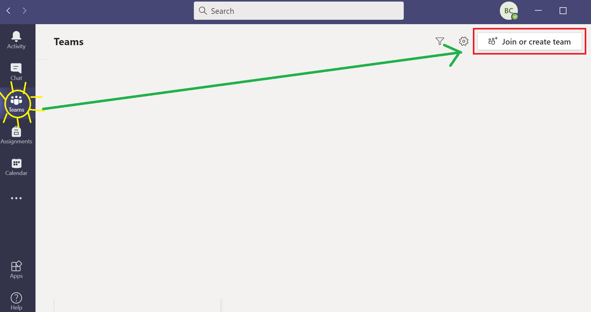
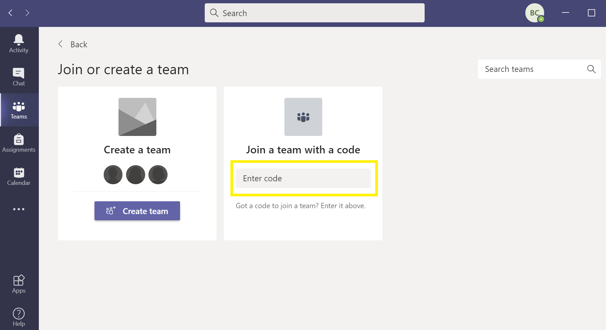

```{r setup, include=FALSE}
knitr::opts_chunk$set(echo = TRUE)
```

## **R & RStudio**

### Download R & RStudio

- [R](https://cran.r-project.org/)
- [RStudio](https://rstudio.com/products/rstudio/download/#download)

### Install

1. R first!
2. RStudio

Will RStudio work without R?

## **MS Teams**

Team Code: **8v3yyjn**

{width=100%}
{width=100%}


## **Class Rules**

- Every question is important!
- Do not hesitate to ask questions!
- Do not hestiate to email!

You can reach me at bhaswar.chakma@ucp.pt

## **Today's Objectives**

- Create RMarkdown document
  + PDF
  + HTML
- R Basics

## **Install TinyTex**

```
tinytex::install_tinytex()
```

## **Survey**

Matter of 5 minutes!

[7 Questions](https://forms.office.com/Pages/ResponsePage.aspx?id=GIvjszm6sUKsGjcltUihuh7wKeA4KWJDr7R5-P2dBuRUMVpXVktGUjRYNkpGUExQWVY1UEUyRUUyOC4u)
