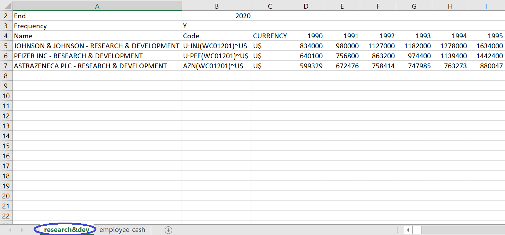
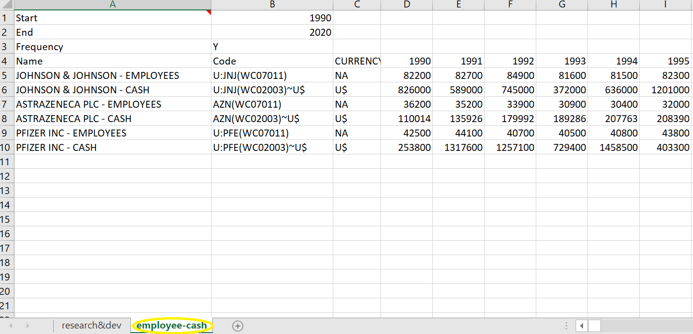

```{r setup, include=FALSE}
knitr::opts_chunk$set(echo = TRUE, warning = FALSE, message = FALSE)
```

#  {.tabset}

## Objectives

- Review `tidyr` functions

- factor variable

- `if_else()`

- `%in%`


## Tidy Data


```{r logo-tidyr, echo = FALSE, fig.align='center'}
knitr::include_graphics("images/tidy-data.png")
```

1. Each variable must have its own column.

2. Each observation must have its own row.

3. Each value must have its own cell.

Four functions:

1. `pivot_longer()`

2. `pivot_wider()`

3. `separate()`

4. `unite()`


## Messy Data{.tabset}

> “Happy families are all alike; every unhappy family is unhappy in its own way.” -- Leo Tolstoy

> “Tidy datasets are all alike, but every messy dataset is messy in its own way.” -- Hadley Wickham


**Data:**

- Create a folder `data` in your project directory. 

- [Click here to download](https://ucppt-my.sharepoint.com/:f:/g/personal/bhaswar_chakma_ucp_pt/EtziHFqAtc5BsmTvQ1nc9XIBP8d6H9_ns-vNPvMzCwjQ3g?e=C5Dwv4) or check in Teams/Files.

- Save them in the `data`folder.

### [**EXERCISE 1**]{style="color: blue;"}

- File: `w10-datastream.xlsx`

- Sheet: `research&dev`


```{r ugly1, echo = FALSE, fig.align='center'}

```


- Do you need all the rows?

- Do you need all the columns?

- Variables needed:

   - `cname`: firms' names
   - `year`
   - `rnd`: Research and Development


```{r df-rnd, echo = FALSE}
library(readxl)
library(tidyverse)
df_rnd <- read_excel("data/w10-datastream.xlsx", 
                             sheet = "research&dev", skip = 3)
df_rnd_clean <- df_rnd %>%
  # drop unwanted variables
  select(-2, -3) %>%
  # reshape
  pivot_longer(
    cols = -1,
    names_to = "year",
    values_to = "rnd"
  ) %>% 
  # year as integer
  mutate(year = as.integer(year)) %>% 
  # Extract names
  separate(Name, into = c("cname", NA), sep = "-")

```


```{r echo = FALSE}
DT::datatable(df_rnd_clean)
```

```{r plot-rnd, echo = FALSE}
df_rnd_clean %>% 
  ggplot(aes(x = year, y = rnd/1e6, color = cname)) + # values are given in thousand
  geom_line() +
  geom_point()
```


### [**EXERCISE 2**]{style="color: blue;"}

- File: `w10-datastream.xlsx`

- Sheet: `employee-cash`


```{r ugly2, echo = FALSE, fig.align='center'}

```


- Do you need all the rows?

- Do you need all the columns?

- Variables needed:

   - `cname`: firms' names
   - `year`
   - `employees`
   - `cash`
   
```{r df-ec, echo = FALSE}
df_ec <- read_excel("data/w10-datastream.xlsx", 
                     sheet = "employee-cash", skip = 3)
df_ec_clean <- df_ec %>% 
  select(-2, -3) %>% 
  pivot_longer(cols = -1,
               names_to = "year",
               values_to = "numbers") %>% 
  separate(Name, into = c("cname", "type"), sep = "-") %>% 
  pivot_wider(names_from = type,
              values_from = numbers) %>%
  rename(employees = 3,
         cash = 4) %>% 
  mutate(year = as.integer(year))


```

```{r echo = FALSE}
DT::datatable(df_ec_clean)
```


```{r emp-plot, echo = FALSE}
# employees
df_ec_clean %>%
  filter(year > 2014) %>% 
  ggplot(aes(x = year, y = employees/1000, fill  = cname)) +
  geom_col(position = "dodge")
```

## Useful Functions & Operators{.tabset}

We will use `gapminder::gapminder`

```{r}
library(gapminder)
gapminder
```

### [**%in%**]{style="color: blue;"}


Suppose we want to consider only these countries: France, Japan, and Australia

- Option 1: use `|`

```
gapminder %>% 
  filter(country == "France" | country == "Japan" | country == "Australia")
```

- Option 1: use `%in%`


```
gapminder %>% 
  filter(country %in% c("France", "Japan", "Australia"))
```

### [**if_else()**]{style="color: blue;"}

Suppose we want to create variable `portugal` (1 when country is Portugal; otherwise 0)

- We have been using `case_when()`

```
gapminder %>% 
  mutate(portugal = case_when(country == "Portugal" ~ 1,
                              country != "Portugal" ~ 0))
```
- We can use `if_else()`

    - Big picture;  `if_else(give_a_condition, value_when_true, value_when_false)`


```
gapminder %>% 
  mutate(portugal = if_else(country == "Portugal", 1, 0))
```

- another option

```
gapminder %>% 
  mutate(portugal = country == "Portugal") # logical
```


```
gapminder %>% 
  mutate(portugal = as.integer(country == "Portugal")) # TRUE becomes 1; FALSE becomes 0

```

