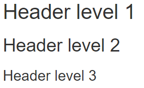

# {.tabset}

## Basics

### Italics and Bold
```
Normal text

**bold**

_italics_	

*italics second option*	
```
Normal text

**bold**

_italics_	

*italics second option*	

### Code Blocks

```
`2+2`	
```
`2+2`	


### Headers

```
# Header level 1
## Header level 2
### Header level 3
```



---


### Footnote

```
text^[My Footnote.]
```
text^[My Footnote.]

### Links

```
[introR](https://af-ucp.courses/introR/)	
```
[introR](https://af-ucp.courses/introR/)	

### Superscript and Subscript

```
super^th^	
sub~pt~
```

super^th^	
sub~pt~	

## R Code

Insert R code chunk: 

- Windows: `Ctrl + Alt + I`
- Mac: `Cmd + Option + I`
- click the insert button

Try `2 + 2`

- show output only `echo = FALSE`


```{r , echo = FALSE}
2+2
```

- show code and output `echo = TRUE`


```{r , echo = TRUE}
2+2
```

- show nothing but run code `include = FALSE`


```{r , include = FALSE}
my_sum <- 2+2
```

- show nothing and  don't run code `echo = FALSE, include = FALSE`


```{r , echo = FALSE, include = FALSE}
2+2
```

- inline code?

- chunk label


## Cross-Referencing & Citations{.tabset}

### bookdown features

```
---
title: "Nice Title"
author: "Your Name"
date: "2/9/2021"
output:
  bookdown::xxx_document2
---

# Chapter One

blah blah

## Fruits

blah blah

### apple
whatever

### banana
whatever

# Chapter Two

## Computers

blah blah

### Windows
whatever

### Mac
whatever
```

**xxx: `html` ; `pdf`**

### Cross-Referencing

```
---
title: "Nice Title"
author: "Your Name"
date: "2/9/2021"
output:
  bookdown::html_document2
---

# Chapter One{#ch1}

blah blah

## Fruits

blah blah

### apple
whatever

### banana
whatever

# Chapter Two

## Computers

blah blah

### Windows
whatever

### Mac
whatever

See chapter \@ref(ch1) for details.
```

### Citations

- Create a `.bib` file.

- Use Google Scholar

- File/New File/ Text File

```
---
title: "Nice Title"
author: "Your Name"
date: "2/9/2021"
output:
  bookdown::html_document2
bibliography: ref.bib
---

# Chapter One{#ch1}

blah blah

## Fruits

blah blah

### apple
whatever

### banana
whatever

# Chapter Two

## Computers

blah blah

### Windows
whatever

### Mac
whatever

See @wickham2014 for further details.

R is awesome[@wickham2014]

*** Note: last section is # Reference. nothing comes after # Reference


# Reference
```

For more detailed instructions, see <https://af-ucp.courses/introR/mrmd.html#citereferences>.

### More Cross-Ref: Plots


-  For the cross-referencing to work, the figure must have a caption.

```
---
title: "Nice Title"
author: "Your Name"
date: "2/9/2021"
output:
  bookdown::html_document2
bibliography: ref.bib
---

# Chapter One{#ch1}

blah blah

## Fruits

blah blah

### apple
whatever

### banana
whatever

# Chapter Two

## Computers

blah blah

### Windows
whatever

### Mac
whatever

See @wickham2014 for further details.

R is awesome[@wickham2014]

## Plots

YOUR TURN:

- Insert R code 
- label it as *pressure*
- use echo=FALSE, fig.cap="A nice plot"
- code: plot(pressure)


See figure \@ref(fig:pressure)

# Reference
```


