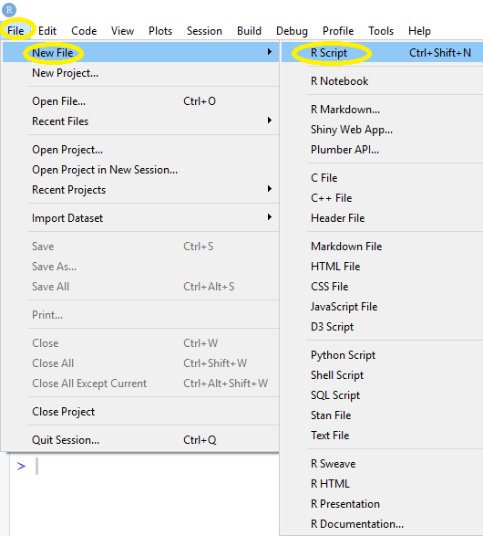
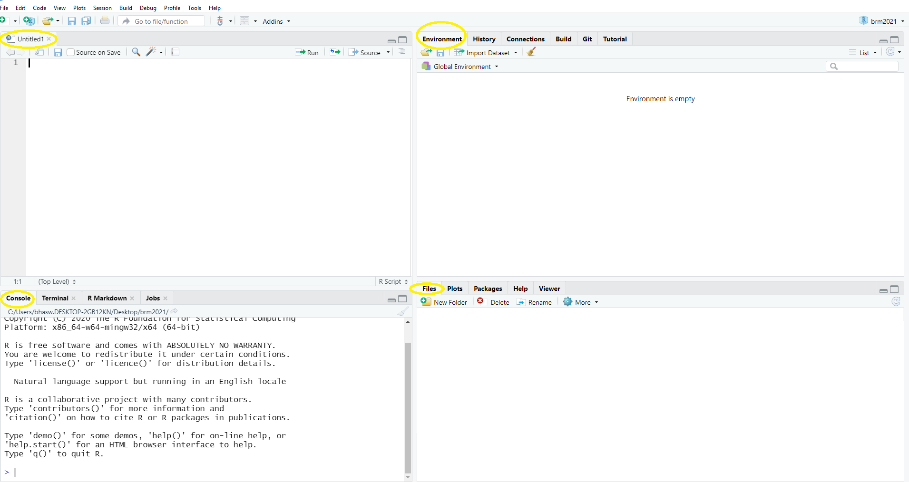
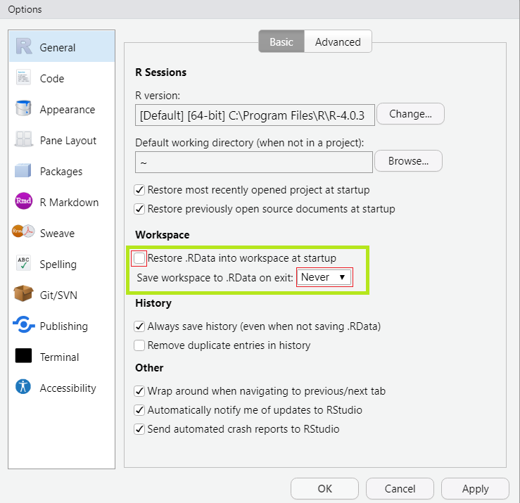

```{r setup, include=FALSE}
knitr::opts_chunk$set(echo = TRUE, message=FALSE, warning = FALSE)
```


# {.tabset}

## Objectives

- R Script

- Working Directory and RStudio Project

- Read Data

- Explore

## R Script


-----------------------------------------------------------------------------

- `<-` : your best friend, the assignment operator.
- `=` does the same job. DO NOT USE IT!
- `#`: write comments







Let's fire up RStudio!

## Working Directory and RStudio Project

### Where are your files?

```{r, eval = FALSE}
getwd()
```

### Change location?


```{r, eval = FALSE}
setwd()
```

- Windows: Copy the path
   - use `\\` or change to `/`

- Mac: Just copy the path
   - Don't know how? Google!

- Example: `setwd("C:/Users/JimiHendrix/Desktop")`

### A wise and common practice

- Use RStudio Project

### Instruct RStudio not to preserve your workspace between sessions

Click `Tools` then `Global Options...`



## Read Data

Files:

 - Text 
 - Excel

Packages Required:

- `readxl`
- `readr`

Steps:

1. Go to the Environment pane
2. Click Import Dataset
3. Select the file type
    - `From Text(readr)` or
    - `From Excel`
4. Locate the file; If needed, modify the options; Done!

Data: 

- Create a folder `data` in your project directory. 
- [Click here to download](https://ucppt-my.sharepoint.com/:f:/g/personal/bhaswar_chakma_ucp_pt/EtziHFqAtc5BsmTvQ1nc9XIBP8d6H9_ns-vNPvMzCwjQ3g?e=C5Dwv4) or check in Teams/Files.
- Save them in the `data`folder.


## Explore

Let's install the `tidyverse`

- It is a set of packages. More info [here](https://www.tidyverse.org/packages/).
  
- `install.packages("tidyverse")`

Today we will use the following packages:

- `dplyr`: use the functions `select()`, `filter()` and `arrange()`
- `magrittr`: use the pipe operator `%>% `


### Example

Inspect the file `mcap20210221.xlsx`.

```{r example1}
library(dplyr)
library(readxl)
read_excel("data/w4/mcap20210221.xlsx", sheet = "global100b") # i put my data in the subfolder w4
df_global <- read_excel("data/w4/mcap20210221.xlsx", sheet = "global100b")

######################
#      Check 
######################
head(df_global) # first six observations
tail(df_global) # last six observations


######################
# Check column names
######################
colnames(df_global)
names(df_global)

#############################
# Number of Columns and Rows
#############################
nrow(df_global)
ncol(df_global)
###################
# Structure & Class
#####################
str(df_global)
glimpse(df_global)
class(df_global)
#########
# Rename
########
names(df_global)
# We can use column position or name
rename(df_global, code = 1) 
rename(df_global, mcap = "Company Market Cap") 

# Does anything get stored?
# Nothing gets stored; you just see output
df_global2 <- rename(df_global, mcap = 3)# now check!

###############################
# Many variables to be renamed?
###############################
# Pipe operator: %>% 
# Windows: ctrl + shift + m
# Mac: cmd + shift + m
names(df_global)# Let's check the names again
df_global %>% 
  rename(code = 1,
         cname = "Company Common Name",
         mcap = "Company Market Cap",
         country = "Country of Headquarters",
         industry = "TRBC Industry Name")

# store it as df_global
df_global <- df_global %>% 
  rename(code = 1,
         cname = "Company Common Name",
         mcap = "Company Market Cap",
         country = "Country of Headquarters",
         industry = "TRBC Industry Name")
# remove df_global2
rm(df_global2)
######################
# How many industries?
######################
table(df_global$industry)

#################################################################
# Get data for only Pharmaceuticals; Lowest & Largest Market Cap
#################################################################
df_global %>% 
  filter(industry == "Pharmaceuticals")

# Lowest Market Cap; use arrange()
df_global %>% 
  filter(industry == "Pharmaceuticals") %>% 
  arrange(mcap)

# Largest
df_global %>% 
  filter(industry == "Pharmaceuticals") %>% 
  arrange(- mcap) # or arrange(desc(mcap))

##############################
# keep only required variables
##############################
# suppose we only need cname and mcap
df_global %>% 
  select(cname, mcap)

#################
#     Stats
################
mean(df_global$mcap)
median(df_global$mcap)
min(df_global$mcap)
max(df_global$mcap)
summary(df_global$mcap)
summary(df_global)# whole data frame

```

## Exercises

**Always inspect the file!**

### Exercise 1

**File**: *mcap20210221.xlsx*; **Sheet**: *global100b*


##### Questions
1. Largest firm?
2. Create a new data frame `df_banks`, containing banks only.
    - Largest bank?
    - Find summary statistics
    - Which country has the largest share?
    


### Exercise 2

**File**: *mcap20210221.xlsx*; **Sheet**: *pt*

  - Store it as `df_pt`
  - Use the same names e.g. mcap is Company Market Cap 


##### Questions
1. Largest firm?
2. Create a new data frame `df_pt_leisure`, containing firms that are in *Leisure & Recreation* industry
    - Largest firm?
    - Smallest firm?
    - Find summary statistics

    