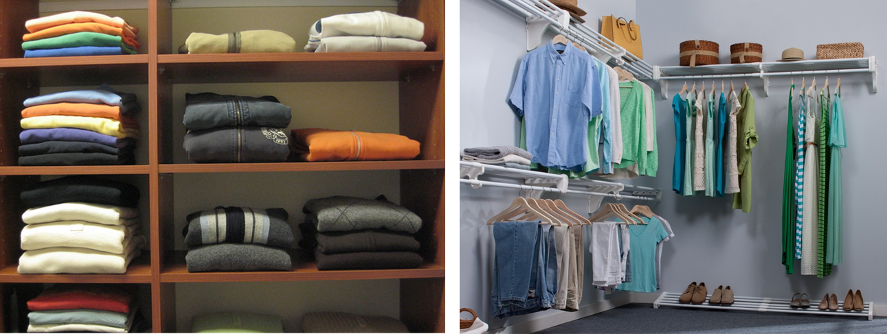

```{r setup, include=FALSE}
knitr::opts_chunk$set(echo = TRUE, message=FALSE, warning = FALSE)
```

##  {.tabset}

### Objectives

-   **dplyr::Two table verbs**

    -   `inner_join()`; `left_join()`; `right_join()`; `full_join()`
    -   `bind_rows()`

-   **dplyr::Grouping**

    -   `rowwise()`

### `*_join()`

#### Data

```{r data-s1, echo = TRUE}
library(dplyr)
library(readxl)
df_a1 <- read_excel("data/w6-students.xlsx", sheet = "A1")
df_a2 <- read_excel("data/w6-students.xlsx", sheet = "A2") 
```

-   sheet = "A1": `df_a1`

```{r, echo=FALSE}
df_a1 
```

-   sheet = "A2": `df_a2`; Robin went to Japan; Ranjit attended

```{r, echo=FALSE}
df_a2
```

#### [**LEFT JOIN**]{style="color: blue;"}

```{r left1, eval=FALSE}
# Option 1
left_join(df_a1, df_a2, by = "name") # here "name" is key; You can use, when needed, multiple keys e.g. by = c("id", "name")
```

```{r left2}
# Option 2
df_a1 %>%
  left_join(df_a2, by = "name")
```

#### [**RIGHT JOIN**]{style="color: blue;"}

```{r right1, eval=FALSE}
# Option 1
right_join(df_a1, df_a2, by = "name")
```

```{r right2}
# Option 2
df_a1 %>%
  right_join(df_a2, by = "name")
```

#### [**INNER JOIN**]{style="color: blue;"}

```{r inner11, eval=FALSE}
# Option 1
inner_join(df_a1, df_a2, by = "name")
```

```{r inner2}
# Option 2
df_a1 %>%
  inner_join(df_a2, by = "name")
```

#### [**FULL JOIN**]{style="color: blue;"}

```{r full1, eval=FALSE}
# Option 1
full_join(df_a1, df_a2, by = "name")
```

```{r full2}
# Option 2
df_a1 %>%
  full_join(df_a2, by = "name")
```


#### [Taks 1: Prepare data for the next exercise (5 min)]{style="color: blue;"}

Do not create intermediate objects; Use `%>%`

-   **Step 1:** Full join `df_a1` and `df_a2`

-   **Step 2:** Update Ranjit's info: age is 70; gender is male (Hint: use `case_when()`)

-   **Step 3:** Mutate a variable `section`, which will contain the text "Section 1"

-   **Step 4:** store the data frame as `df_s1`

```{r df-s1, echo = FALSE}
df_s1 <- full_join(df_a1, df_a2, by = "name") %>% 
  mutate(
    # UPDATE AGE
    age = case_when(name == "Ranjit" ~ 70,
                    name != "Ranjit" ~ age),
    # UPDATE GENDER
    gender = case_when(name == "Ranjit" ~ "Male",
                       name != "Ranjit" ~ gender),
    # GENERATE SECTION
    section = "Section 1"
  )
df_s1
```


#### [**Coercion**]{style="color: blue;"}

> [vocabulary.com](https://www.vocabulary.com/dictionary/coercion): "***Coercion** is making something happen by force, like when bullies use coercion to make kids give them their lunch money*".

```{r closet, echo = FALSE}

```

```{r board, echo = FALSE}

```


$$logical < integer < double < character$$

```
# Create Vectors
# Use c() "combine"
v_character <- c("hello", "world")
v_double <- c(2, 99)
v_integer <- c(2L,99L)
v_logical <- c(TRUE, FALSE) # we could also use T and F (not recommended)

# Check Type
> typeof(v_character)
[1] "character"
> typeof(v_double)
[1] "double"
> typeof(v_integer)
[1] "integer"
> typeof(v_logical)
[1] "logical"
```


**Coercion in action:**

```
> typeof(c("Hello", 2.299, 1L, FALSE))
[1] "character"
> 
> typeof(c(2.299, 1L, FALSE))
[1] "double"
```


### `bind_rows()` & `rowwise()`


File: `w6-students-s2.csv`; store it as `df_s2`

```{r data-s2, echo = FALSE}
df_s2 <- readr::read_csv("data/w6-students-s2.csv")
df_s2
```


Can you find the mean of `assignment1`?

  - try `mean(df_s2$assignment1)`

Have a glimpse of `df_s2`
```{r glimpse-s2}
glimpse(df_s2)
```
Who is the boss?

We need to use [**`as.numeric()`**]{style="color: blue;"}.

```{r asnumeric-ex}
df_s2 <- df_s2 %>%
  mutate(assignment1 = as.numeric(assignment1))
df_s2
```
We can now use `mean(df_s2$assignment1)` but we must the argument [**`na.rm = TRUE`**]{style="color: blue;"} 
```{r}
mean(df_s2$assignment1, na.rm = TRUE)
```

[**Problem 1: Bind the rows of `df_s1` and `df_s2`; call it `df_all`**]{style="color: blue;"}

[**Solution 1:**]{style="color: blue;"}.

```{r binded}
bind_rows(df_s1, df_s2)
```

[**Problem 2: For each student, find average grade**]{style="color: blue;"}

[**Solution 2:**]{style="color: blue;"}

```{r}
bind_rows(df_s1, df_s2) %>% 
  rowwise() %>% 
  mutate(avg_grade = mean(c(assignment1, assignment2), na.rm = TRUE))
```

Do not forget to `ungroup()`.
