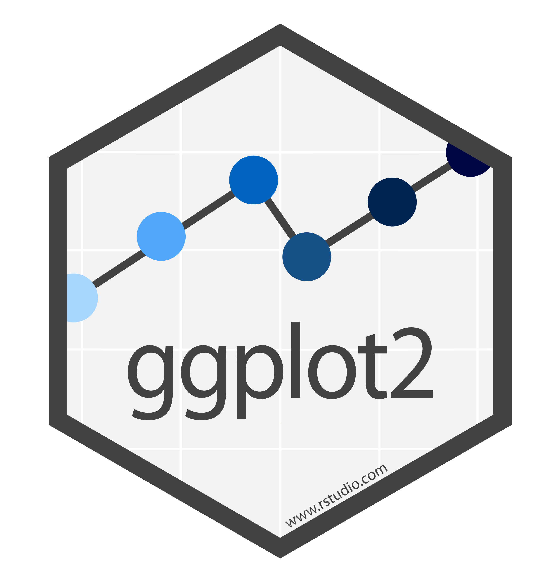

```{r setup, include=FALSE}
knitr::opts_chunk$set(echo = TRUE, message = FALSE, warning = FALSE)

library(tidyverse)
library(gapminder)
```

#  {.tabset}

## Objective

```{r, echo = FALSE}

```

## Big picture

Grammar of graphics
Every ggplot2 plot has three key components:

-   data,

-   a set of aesthetic mappings between variables in the data and visual properties, and

-   at least one layer which describes how to render each observation. Layers are usually created with a geom function.


```
library(ggplot2)
library(dplyr)
```

**Data**

Try `?mpg`

We will work with the following variables:

- `disp`, a car’s engine size, in litres.

- `hwy`, a car’s fuel efficiency on the highway, in miles per gallon (mpg). A car with a low fuel efficiency consumes more fuel than a car with a high fuel efficiency when they travel the same distance.

- `class`, "type" of car

- `drv`, the type of drive train, where f = front-wheel drive, r = rear wheel drive, 4 = 4wd

- `cyl`, number of cylinders


```{r}
ggplot2::mpg %>%
  select(manufacturer, displ, hwy, class, drv, cyl)
```

**ggplot in action**

```{r}
ggplot(mpg, aes(x = displ, y = hwy)) 
# mpg %>% ggplot(aes(x = displ, y = hwy))
```

```{r}
ggplot(mpg, aes(x = displ, y = hwy)) + 
  geom_point()

# Alternative:
# mpg %>%
#  ggplot(aes(x = displ, y = hwy)) +
#  geom_point()
```

Note: Instead of `%>%`, we need to use `+`

Change points' color

```{r}
ggplot(mpg, aes(displ, hwy)) +
  geom_point(colour = "blue") # color works as well
```

**Color names in R:**

```{r, echo = FALSE}
knitr::include_graphics("images/r-colors.png")
```

**Summary**

You must provide 3 elements

1. data
2. aes
3. geom


## Aesthetic attributes

- Color
- Size
- Shape

### Color

```{r}
ggplot(mpg, aes(displ, hwy, color = class)) + # colour works as well
  geom_point()
```

### Shape

```{r}
ggplot(mpg, aes(displ, hwy, shape = drv)) + 
  geom_point()
```

### Size

```{r}
ggplot(mpg, aes(displ, hwy, size = cyl)) + 
  geom_point()
```

-   color and shape work well with categorical variables.

-   size works well for continuous variables.

-   if there is a lot of data it can be hard to distinguish different groups.

## Exercise 

-   `install.packages("gapminder")`

```{r, echo = TRUE}
library(gapminder)
gapminder
```

The main data frame `gapminder` has 6 variables:

-   **country**: factor with 142 levels

-   **continent**: factor with 5 levels

-   **year**: ranges from 1952 to 2007 in increments of 5 years

-   **lifeExp**: life expectancy at birth, in years

-   **pop**: population

-   **gdpPercap**: GDP per capita (US\$, inflation-adjusted)

[**Prepare data**]{style="color: blue;"}

1. use the data frame `gapminder`

2. consider only 2007 data
    
3. generate a variable `pop_m`, expressing `pop` in millions
    
4. call the data frame `df`


[**Produce the following graphs:**]{style="color: blue;"}


```{r, echo = FALSE}
df <-  gapminder %>%
  filter(year == 2007) %>% 
  mutate(pop_m = pop/1e6)

```

**Figure 1**
```{r, echo = FALSE}
# fig1
ggplot(df, aes(x = gdpPercap, y = lifeExp)) +
  geom_point()
```

**Figure 2**
```{r, echo = FALSE}
# fig2
ggplot(df, aes(x = gdpPercap, y = lifeExp, color = continent)) + 
  geom_point()
```

**Figure 3**
```{r, echo = FALSE}
# fig3
ggplot(df, aes(x = gdpPercap, y = lifeExp, shape = continent)) + 
  geom_point()

```
**Figure 4**
```{r, echo = FALSE}
# fig4
ggplot(df, aes(x = gdpPercap, y = lifeExp, size = pop_m, color = continent)) + 
  geom_point()
```

## Geom

- `geom_point()`
- `geom_bar()`
- `geom_col()`
- `geom_hist()`
- `geom_line()`
- `geom_box()`


**Number of variable(s) needed for bar/histogram?**

###  {.tabset}

[Ex1 Solution](https://ucppt-my.sharepoint.com/:f:/g/personal/bhaswar_chakma_ucp_pt/El1Sto_paa9OgnaTRzM38QMBFWE-s1IUP8xYKGHjzftNeA?e=JJYpNH)

#### bar() and col()

- geom_bar() by default will show count of observations

```{r}
# bar plot: geom_bar()
# note: default is count of obs
ggplot(data = df, aes(x = continent)) +
  geom_bar()
```

- Suppose we want to plot median population by continent

  - `geom_bar(stat = "identity")`
  - `geom_col()`

```{r}
# find median:
df %>% 
  group_by(continent) %>% 
  summarize(pop_median = median(pop_m)) %>%
  # plot:
  ggplot(aes(x = continent, y = pop_median)) +
  geom_bar(stat = "identity")
```

```{r}
# find median:
df %>% 
  group_by(continent) %>% 
  summarize(pop_median = median(pop_m)) %>%
  # plot:
  ggplot(aes(x = continent, y = pop_median)) +
  geom_col() 
```
**Another data set**

```{r, echo = FALSE}

```


`ggplot2::diamonds`

- `cut` quality of the cut (Fair, Good, Very Good, Premium, Ideal)


- `clarity` a measurement of how clear the diamond is (I1 (worst), SI2, SI1, VS2, VS1, VVS2, VVS1, IF (best))

```{r, echo = FALSE}
ggplot2::diamonds %>% 
  select(cut, clarity)
```

```{r}
table(diamonds$cut)
```

```{r}
ggplot(data = diamonds, aes(x = cut, colour = cut)) + 
  geom_bar()
```

```{r}
ggplot(data = diamonds, aes(x = cut, fill = cut)) + 
  geom_bar()
```

```{r}
table(diamonds$cut, diamonds$clarity)
```

```{r}
ggplot(data = diamonds, aes(x = cut, fill = clarity)) + 
  geom_bar()
```

```{r}
ggplot(data = diamonds, aes(x = cut, fill = clarity)) + 
  geom_bar(position = "dodge")
```


#### histogram()

```{r}
#------------
# Histogram
#------------
ggplot(data = df, aes(x = gdpPercap)) +
  geom_histogram()

# Note: ggplot by default uses 30 bins
# you can tweak the settings

ggplot(data = df, aes(x = gdpPercap)) +
  geom_histogram(bins = 15) # change bins

```

#### boxplot()

```{r}
#---------------
# Box plot
#---------------
ggplot(data = df, aes(x = continent, y = lifeExp)) +
  geom_boxplot()

# you can add layer
ggplot(data = df, aes(x = continent, y = lifeExp)) +
  geom_boxplot() +
  geom_point()
```

#### line()

```{r}
df_pt <- filter(gapminder, country == "Portugal")
df_pt
```
```{r}
ggplot(data = df_pt, aes(x = year, y = gdpPercap)) +
  geom_line()
```

```{r}
ggplot(data = df_pt, aes(x = year, y = gdpPercap)) +
  geom_line() +
  geom_point()
```


[Take the quiz!](https://forms.office.com/Pages/ResponsePage.aspx?id=GIvjszm6sUKsGjcltUihuh7wKeA4KWJDr7R5-P2dBuRUNzY0M1FSQUJOWk5EOUFEM05GSUFTTlJNVS4u)

## RMD

```{r, echo = FALSE}

```

